#### 实施步骤介绍

我们以smart-search v2版本为例，为大家讲解方案的整个部署流程。

##### 1、环境准备

首先您需要在您的开发环境中安装好python 3、pip以及npm等通用工具，并保证您的环境中拥有16GB以上的存储空间。根据您的使用习惯，您可以在自己的开发笔记本（Mac OS或Linux环境）上部署，也可以选择EC2或者Cloud9进行部署。
同时账号需要满足相应的条件：
1. Lambda并发数默认值为1000，某些新账号需要在Service Quota里提升到默认值或者更多
2. SageMaker Endpoints的服务限制，需要把ml.g4dn.2xlarge的服务限额提到2个以上。如果用到其他类型的实例比如ml.p3.2xlarge同理。
3. 在中国区80和443端口默认是关闭状态，需要从前端访问时需要通过AWS接口人进行端口开启的申请。

##### 2、CDK自动部署

2.1.获取代码后把代码拷贝到指定目录下。打开终端窗口，进入smart_search的软件包，并切换到名为deployment 文件夹下：
```
cd smart_search/deployment
```
进入到deployment目录后，相应的CDK部署操作均在该目录下进行。然后安装AWS  CDK包:
```
npm install -g aws-cdk
```
2.2.安装CDK自动化部署脚本所需的所有依赖项和环境变量

在deployment目录下运行以下命令安装依赖库：
```
pip install -r requirements.txt
```
然后将您的12位AWS账号信息、Acess Key ID、Secret Access Key、以及需要部署的Region ID导入到环境变量中：
```
export AWS_ACCOUNT_ID=XXXXXXXXXXXX

export AWS_REGION=xx-xxxx-x

export AWS_ACCESS_KEY_ID=XXXXXX

export AWS_SECRET_ACCESS_KEY=XXXXXXX
```
然后运行“cdk bootstrap”安装账户和目标区域内的CDK工具包，例如：

```
cdk bootstrap aws://$AWS_ACCOUNT_ID/$AWS_REGION
 ```

##### 2.3.在 cdk.json可以进行自定义配置

该方案的默认配置文件在deployment目录下的cdk.json文件中，如果您想要自行配置需要部署哪些功能模块，您可以根据需要修改cdk.json的“context”部分。例如，如果您需要修改部署哪些功能函数，可以对“selection”值 进行修改。

默认的参数如下所示:
```
"selecton":["knn","knn_faq","feedback","post_selection","xgb_train","knn_doc"]
```
如果您仅需要使用“支持knn的文档搜索功能”，您可以仅保留“knn_doc”。除此之外，您还可以选择通过修改cdk.json的其他相应参数来自定义部署方式、部署哪些插件和名称和路径等配置。

您同样可以指定所需的搜索引擎，将cdk.json里的对应boolean值改为 ‘true’即可。
```
"search_engine_opensearch":true,
"search_engine_kendra":false,
```

您同时可以指定vpc_deployment的boolean值来配置是否进行vpc部署，其他信息来自于您现有VPC的相关配置。如果您不指定vpc_name，该方案将会给您生成一个默认名为“smart_search-vpc”的vpc。
```
"vpc_deployment": false,
"vpc_name": "smart_search-vpc",
"subnet_name": "smart_search-subnet-private1-us-east-1a",
"subnet_id": "subnet-1234",
"zone_id": "use1-az4",
```

##### 2.4.CDK命令自动化部署

运行下面的命令将验证环境并生成Amazon CloudFormation的json模版
```
cdk synth
```
如果没有报错，则运行以下命令部署全部堆栈。
```
cdk deploy --all
```
CDK 部署将提供相关 Amazon CloudFormation 堆栈以及相关资源，例如Amazon Lambda、Amazon API Gateway、Amazon OpenSearch 实例和 Amazon SageMaker的notebook实例等，预计安装的部署时间大约为30分钟左右。

##### 3、利用Amazon SageMaker的Notebook实例部署模型与数据导入[](https://catalog.us-east-1.prod.workshops.aws/workshops/8949768c-f737-429d-a234-46cb632328d7/en-US/02cdkinstall/22configure#sagemaker-endpoint)

##### 3.1部署模型

3.1.1. 进入Amazon SageMaker控制台，进入NoteBook Instances，选择SmartSearchNoteBook实例，  点击“Open Jupyter”，进入SmartSearch的代码主目录，点击“isearchjupyter”目录进入，您能看到包括Embbeding Model、LLM_Model等目录，这两个目录包含模型部署脚本，而Script-Doc.ipynb脚本则会用于后面的文档上传，目录如下图所示：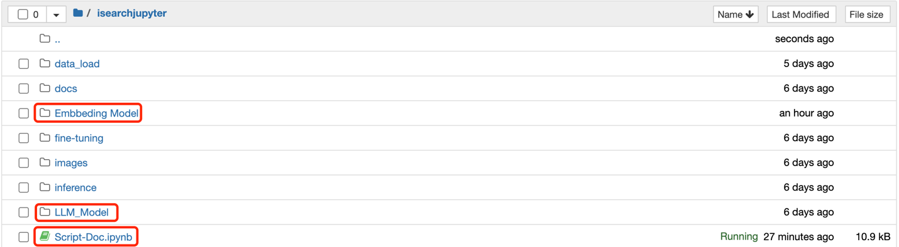

3.1.2. 首先安装Embbeding Model，进入“/isearchjupyter/Embbeding Model”目录，能看到对应的几个脚本。其中“EmbbedingModel_shibing624_text2vec-base-chinese.ipynb”为中文的词向量模型，其他两个为英文，打开相应脚本依次运行单元格，可以根据需要设置instance_type的类型，开始部署 embbeding model。等待script部署完毕，成功部署后您会在Amazon SageMaker的endpoint中看到名为“huggingface-inference-eb”的endpoint，状态为“InService”。

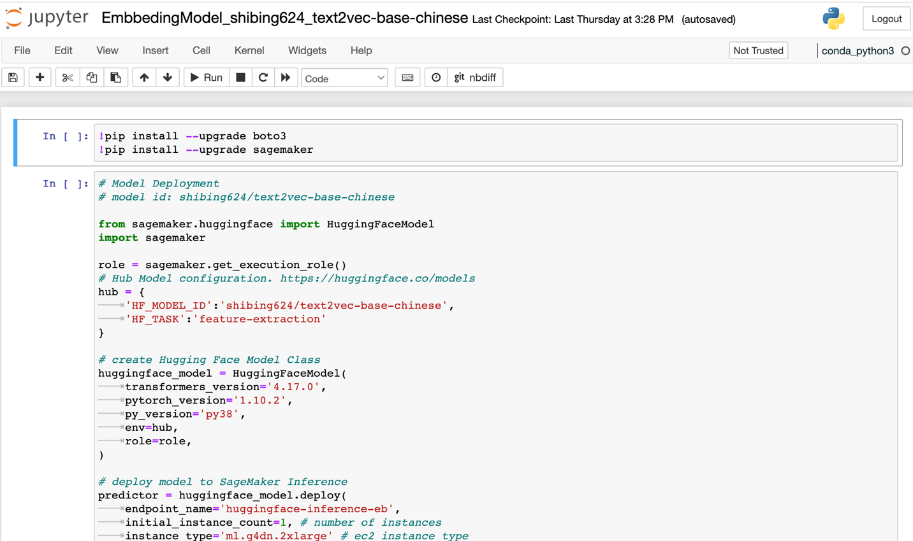

3.1.3. 然后部署大语言模型，LLM_Model目录下当前包含了中文和英文的大语言模型库。这里先为大家介绍中文的大语言模型的部署方法，找到isearchjupyter/LLM_Model/llm_chinese/code/inference.py，该文件定义了大语言模型的统一部署方法。大语言模型可以通过唯一的名称进行部署，我们把该唯一名称声明为“LLM_NAME”的参数值，作为参数传递给部署脚本。您可以根据大语言模型的文档来确定“LLM_NAME”的值。我们以[https://huggingface.co/THUDM/chatglm-6b](https://huggingface.co/THUDM/chatglm-6b)网址文档为参考来说明如何确定“LLM_NAME”值。打开网址后对照该文档找到该模型部署的唯一名称，然后粘贴到为“LLM_NAME”赋值的位置即可，您可以参照该方法举一反三，指定您项目中需要使用的大语言模型。修改inference.py文件后进入“isearchjupyter/LLM_Model/llm_chinese/“目录，运行该目录的script，可以根据需要设置instance_type的类型。等待script部署完毕，成功部署后您会在Amazon SageMaker的endpoint中看到名为“pytorch-inference-llm-v1”的endpoint。

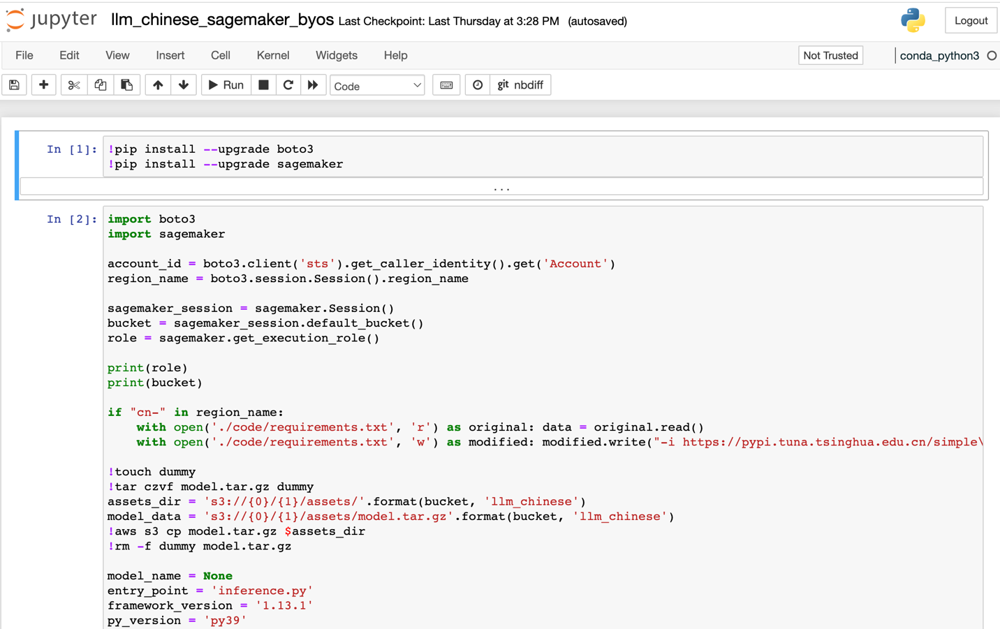

如果您选择部署英文大语言模型，部署方式类似，需要将英文大语言模型的参数填入LLM_Model/llm_english/code/inference.py文件的“LLM_NAME”参数中。以[https://huggingface.co/TheBloke/vicuna-7B-1.1-HF](https://huggingface.co/TheBloke/vicuna-7B-1.1-HF) 为例来说明英文的模型部署，找到该大语言模型项目名称，则然后复制该名称再粘贴到为“LLM_NAME”赋值的位置，您可以用该方法进行举一反三，指定任意一个满足您的业务需求的大语言模型。进入“isearchjupyter/LLM_Model/llm_english/”的目录下，依次运行该目录下英文大语言模型的脚本的部署单元格。如下图所示：

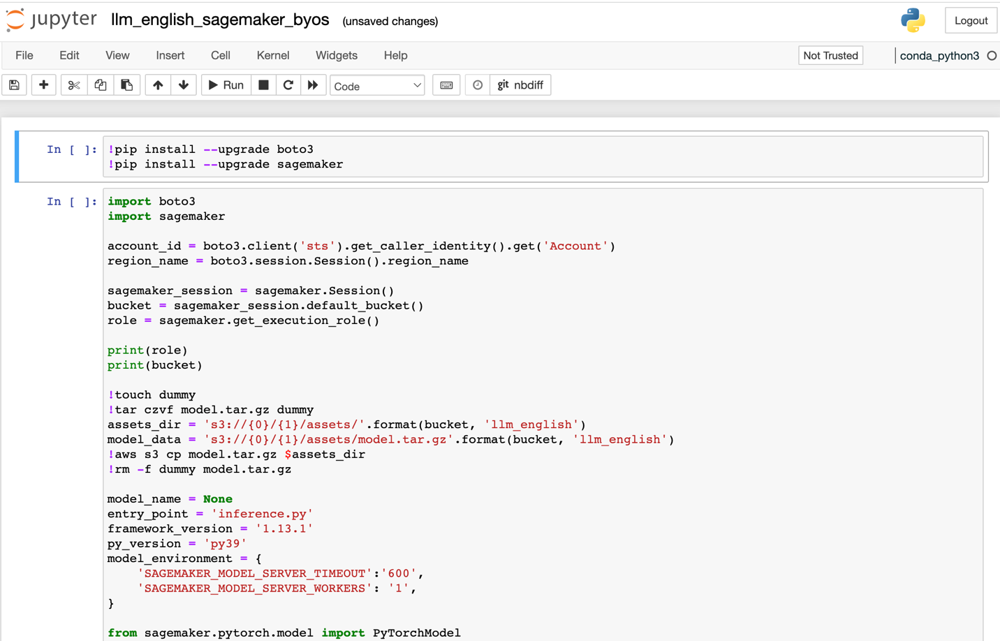

3.1.4.安装完成后，您会看到两个endpoint已经在"InService"状态，如下图：

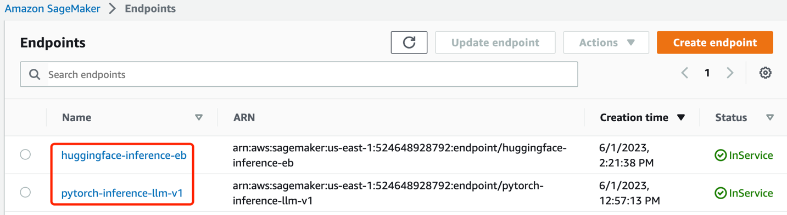

##### 3.2 知识库数据上传
3.2.1 Amazon OpenSearch的情况

1.数据准备。进入jupyter的目录“/isearchjupyter”，在“docs”目录，将上传所需要的word、excel或pdf等格式的文档进行上传，该文件夹下已经提供了用于测试的样例文件“sample.docx”(该样例文件整理自[http://www.360doc.com/content/19/1017/08/7696210_867360083.shtml](http://www.360doc.com/content/19/1017/08/7696210_867360083.shtml) )

2.进入 Script-Doc.ipynb, 修改单元格“Hyperparameter”的如下参数，folder_path为指定的docs目录，index_name为Amazon OpenSearch的index名称，如下图： 

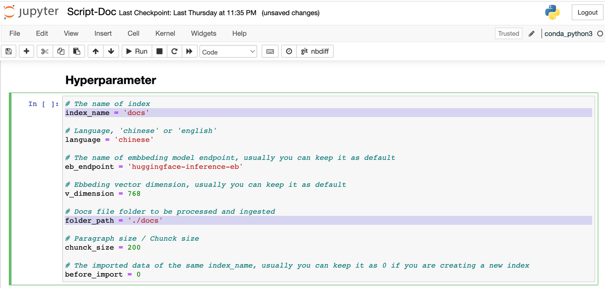 

然后从头运行这个scipt，完成数据导入。

3.2.1 Amazon Kendra的情况

Amazon Kendra会自动生成一个“smart-search-kendra-index”的index，还有一个名字“smart-search-kendra-s3-source-bucket”开头的S3桶。将需要同步的数据资料放到该桶中。然后进入Amazon Kendra控制台中，手动同步数据源即可。
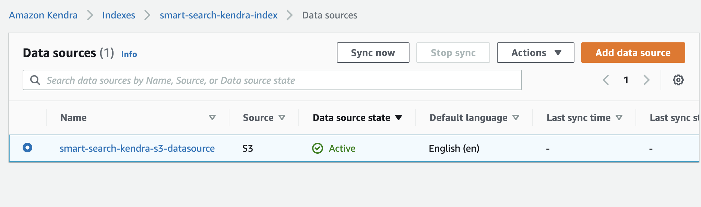 

##### 4、配置Web UI

4.1.进入smart_search/ search-web-knn目录，该目录包含基于React的前端界面代码。然后对 /src/pages/common/constants.js文件进行编辑, 如下图所示：

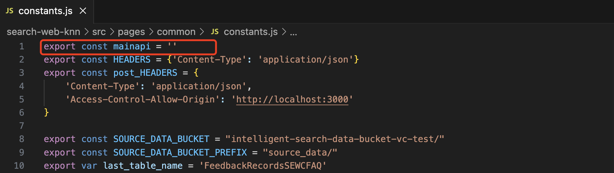

Mainapi常变量指定了前端调用的API入口。 该值可以从网页端进入API Gateway中获取，进入“smartsearch-api”的Stages侧边栏，将prod stage的involke URL赋值给constants.js的mainapi常变量，例如：[https://xxxxxxxxxx.execute-api.us-east-1.amazonaws.com/prod](https://xxxxxxxxxx.execute-api.us-east-1.amazonaws.com/prod)


4.2.检查主页面参数配置。smart_search/search-web-knn/src/pages/MainSearchDoc.jsx为功能展示页面, 在该文件的last_index参数设置了页面自动填充的默认index值，将上文Notebook实例部署的index name填入，如“docs”。

4.3.运行前端界面。进入目录 search-web-knn，执行如下两条命令：
```
npm install
```
然后运行以下命令启动前端界面：
```
npm start
```
一切顺利的话，您将得到一个网页版界面。在本地开发笔记本部署的默认访问地址和端口号是localhost：3000，如果是EC2部署，需要启用对应端口访问的安全组策略，通过EC2的公网地址加端口号进行访问。该前端页面的使用方法为：将问题输入搜索栏，配置index名称和k-NN选项，点击“Search”按钮后您可以得到一个基于企业知识库的大语言模型汇总回答。如下图所示：

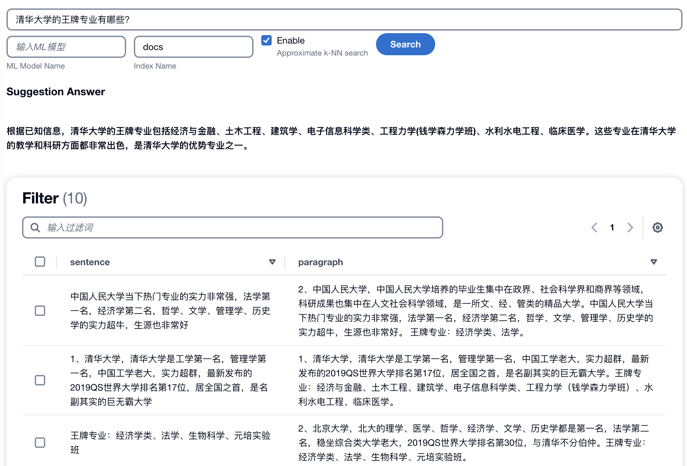

##### 5、安装扩展插件（可选）

###### 5.1 与Amazon Lex集成实现智能聊天机器人

本方案已经集成了Amazon Lex的会话机器人功能，Amazon Lex当前在海外区可用。在cdk.json文件中，将“lexbot”加入extension键值处。
```
   "extension": ["lexbot"]
```
cdk部署成功后进入管理界面可以看到名为“llmbot”的对话机器人，如下图：

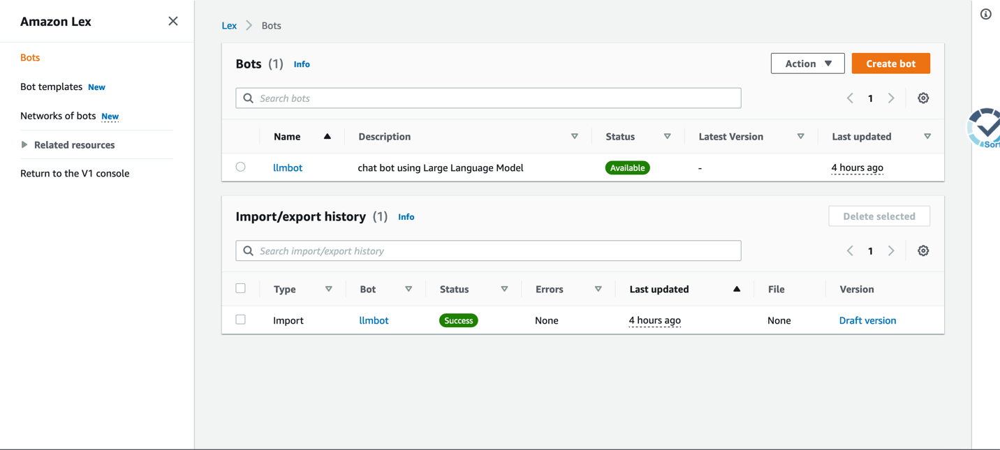

该机器人可以方便的在进行前端页面的集成，例如，您可以启动[https://github.com/aws-samples/aws-lex-web-ui](https://github.com/aws-samples/aws-lex-web-ui)中对应区域的部署模板 ，并将llmbot的信息（LexV2BotId、alias ID等）到填写CloudFormation模板中即可。Lex机器人的工作界面如下图所示。


###### 5.2 与Amazon Connect集成实现智能语音客服

Amazon Connect为亚马逊云科技的云呼叫中心服务，该服务当前在海外区可用。该方案可以通过Amazon Lex机器人将大语言模型能力集成到Amazon Connect云呼叫中心中，通过以下几个步骤可以使您获得一个支持语音呼叫功能的智能客服机器人。

5.2.1. 将上一步生成的llmbot机器人集成到现有Amazon Connect实例中。

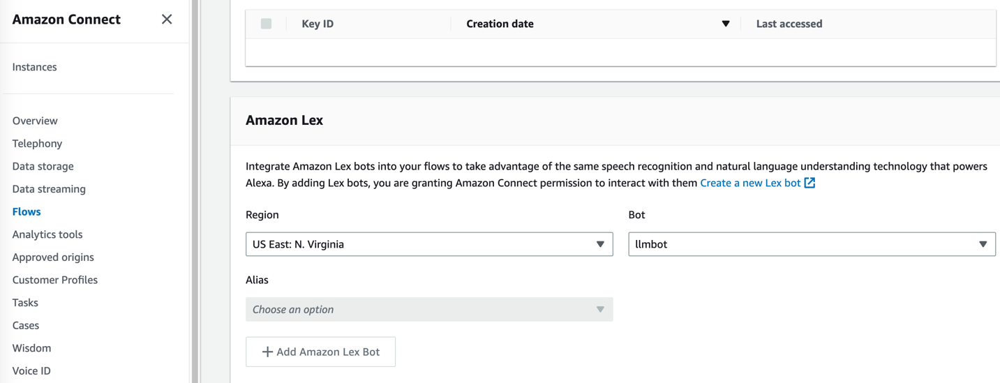

5.2.2. 然后进入Amazon Connect实例中，将smart-search/extension/connect里面的文件导入到Contact Flow中，并保存和发布。

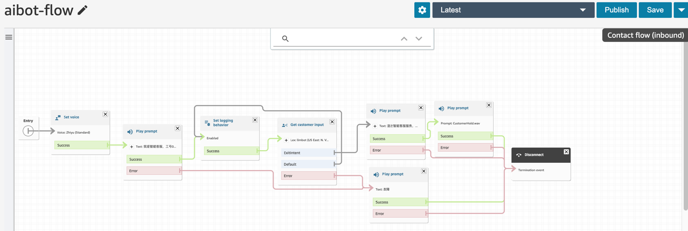

5.2.3. 最后在Amazon Connect中将呼入号码与上一步配置的Contact Flow进行关联。则所有呼入该号码的语音通话将会连接到智能客服的呼叫服务流程。

正常情况下，智能客服将会识别呼入人的语音输入，随后集成到Amazon Connect的智能客服机器人会基于企业知识库信息和大语言模型的能力进行以接近人类的逻辑方式进行语音回答。

##### 6、资源清理

当您想要将资源进行清理时，请使用以下命令将所有堆栈进行删除：
```
cdk destroy --all
```
** 注意 **
通过Amazon SageMaker的Notebook实例创建的推理模型资源需要进行手动删除，在Amazon SageMaker的“inference”边栏进入“endpoint”，点击“delete”，将所有endpoint进行删除，也同时删除“endpoint configurations”

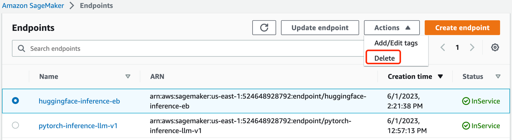

当堆栈创建的Amazon S3桶中已经有了数据或者存在其他手动创建或修改的资源时，则也需要手动删除。

更详细的部署文档介绍，请参照：
https://catalog.us-east-1.prod.workshops.aws/workshops/8949768c-f737-429d-a234-46cb632328d7/en-US
