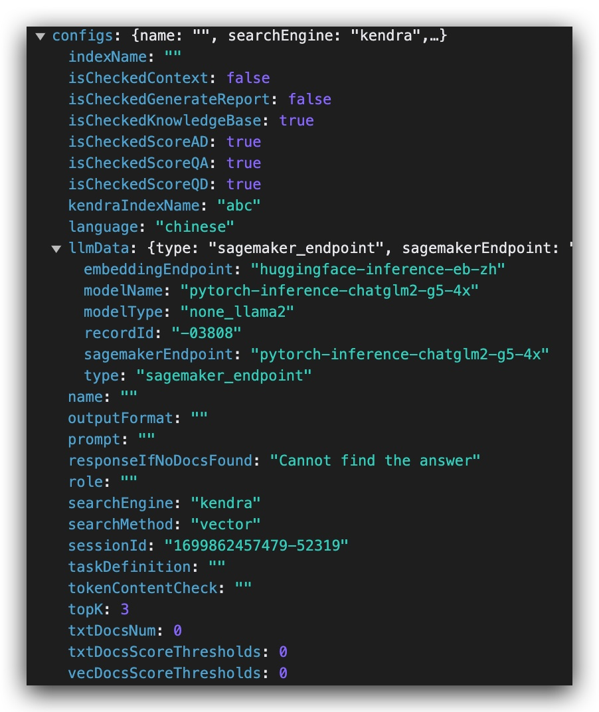

# Explain the API from a frontend perspective

You can find websocket connection named 'prod/' in the network tab of the browser console.

In the messages, you can find the data transmitting between the frontend and the backend. The most important things are `configs` object (an example below, mostly self-explanatory) and the `query` string.

